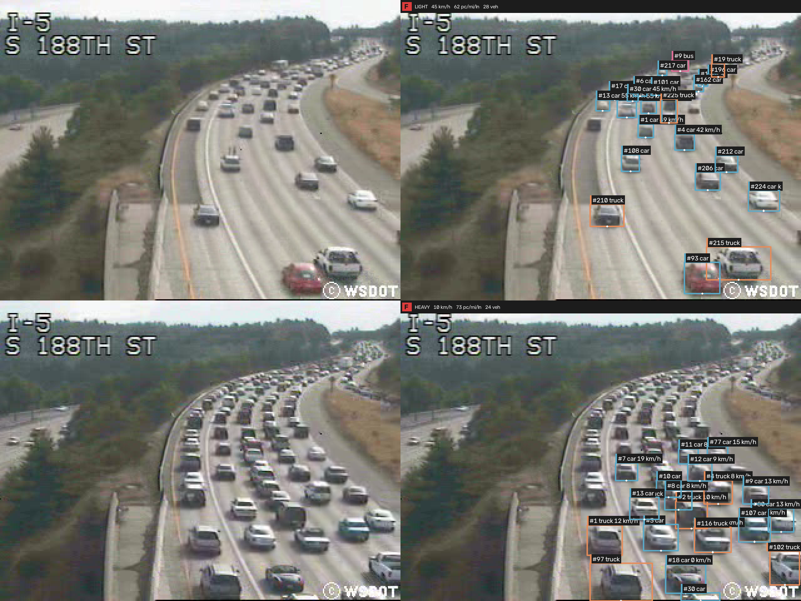
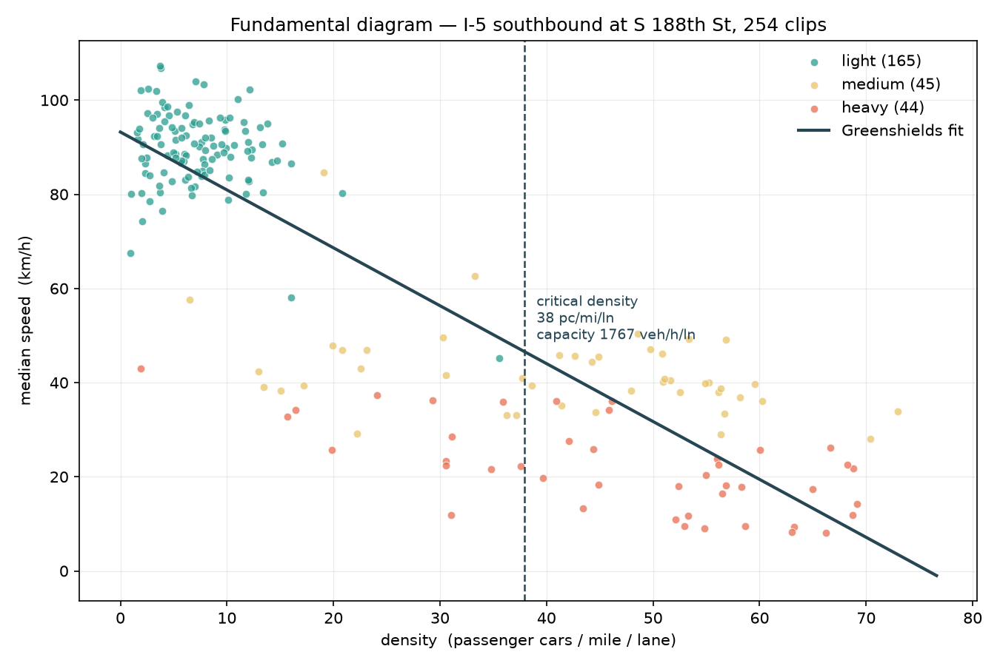

# Traffic Flow Analysis with Computer Vision

Detects, tracks and measures every vehicle in highway camera video. It reports vehicle counts
and types, speed, density, level of service, lane occupancy, trajectories and congestion
class, and turns those numbers into insights and recommendations for traffic management.
It works in two ways: a batch pipeline over the full dataset, and a web app that analyses any
video live in the browser.



---

## 1. See the demo first

No installation needed: every result below is already in the repository.

| What | File |
|---|---|
| Annotated videos: every vehicle boxed with its ID, type and speed | [light traffic](demo/light_cctv052x2004080516x01640.mp4) · [medium traffic](demo/medium_cctv052x2004080516x01638.mp4) · [heavy traffic](demo/heavy_cctv052x2004080516x01646.mp4) |
| Before and after: raw frames beside the analysed ones | [`demo/what_the_shapes_are.png`](demo/what_the_shapes_are.png) |
| Charts over all 254 clips | [speed vs density](demo/fundamental_diagram.png) · [speed by hour](demo/hour_profile.png) · [lane usage](demo/lane_usage.png) · [speed by traffic class](demo/speed_distribution.png) |
| Full written analysis and recommendations | [`output/reports/insights.md`](output/reports/insights.md) |
| Every parameter for every clip | [`output/parameters/clips.csv`](output/parameters/clips.csv) |
| Colab notebook results: calibration and model training | [`demo/notebooks/results.md`](demo/notebooks/results.md) |

The videos are MP4 (mp4v). Download them and open them in VLC or Windows Media Player.

---

## 2. Key findings

**Site.** Interstate 5 southbound at S 188th St, Seattle. 254 clips from August 2004, each
320×240 at 10 fps and about 5 seconds long, labelled *light*, *medium* or *heavy*.

| Finding | Result |
|---|---|
| Free-flow speed | **98.4 km/h**, within 2% of the posted 96.6 km/h, confirming the calibration |
| Median speed | light **90** · medium **40** · heavy **22** km/h |
| Critical density | **30.9 pc/mi/ln**: past this point, more vehicles mean less throughput |
| Peak congestion | **15:00–18:00** at level of service F, worst at **17:00** (24 km/h) |
| Vehicle mix | buses and trucks are **12.2%** of traffic |
| Lane occupancy | 10–43% per lane in light traffic, 86–95% in heavy |
| Congestion classifier | **93.7% accuracy, 0.888 macro-F1** with whole recordings held out |



### Recommendations

1. **Meter the S 188th St on-ramp during the afternoon peak.** Holding the mainline just below
   the critical density keeps traffic flowing instead of breaking down.
2. **Set control thresholds from this segment's measured critical density,** not from generic
   national values.
3. **Review HOV lane use before adding capacity.** Better lane distribution costs far less
   than new lanes.

---

## 3. Run it yourself: first time

### Step 1: Install

You need Python 3.11 or newer. A GPU is not required.

```bash
git clone https://github.com/Shady-Abdelaziz/traffic-flow-analysis.git
cd traffic-flow-analysis
pip install torch torchvision --index-url https://download.pytorch.org/whl/cpu
pip install -r requirements.txt
```

PyTorch comes first, from its CPU index, so pip does not download 2.5 GB of GPU libraries.

### Step 2: Download the dataset

Download the dataset from
[Kaggle](https://www.kaggle.com/datasets/aryashah2k/highway-traffic-videos-dataset) and
extract it to `archive/` inside the project, so that `archive/video/` holds the 254 clips.
The trained models and calibration are already in the repository.

### Step 3: Open the web app

```bash
python run.py serve
```

On Windows you can double-click `start.bat` instead. The browser opens at
**http://127.0.0.1:8000**.

- **Live tab.** Drag in any short traffic video (5–10 s works best). The whole video is
  analysed first, then played back with a timeline and a speed control. Each vehicle shows
  a box, ID, type and speed, and the side panel updates every second: congestion class,
  level of service, speed, density, vehicle count, lane occupancy and a one-line insight.
- **Results tab.** Findings across every video the app has analysed: free-flow speed,
  critical density, speed against density, speed by hour, classifier accuracy and
  recommendations. It fills in as you analyse videos, or all at once after Step 4.

### Step 4: Analyse the whole dataset

```bash
python run.py detect          # detect and track vehicles in all 254 clips (~25 min on a laptop CPU, resumable)
python run.py all --videos    # parameters, classifier, charts, annotated videos, report (seconds)
python run.py demo            # the three demo videos with the larger yolo26m model (a few minutes)
```

`detect` is the only slow step. Everything after it reads the saved detections and finishes
in seconds.

| Command | What it produces |
|---|---|
| `python run.py detect` | `output/tracks/`: one track table per clip |
| `python run.py params` | `output/parameters/clips.csv`: every parameter for every clip |
| `python run.py train` | `output/reports/eval_parameters.json`: classifier scores against baselines |
| `python run.py visuals --videos` | `output/figures/` charts and `output/videos/` annotated clips |
| `python run.py report` | `output/reports/insights.md`: insights and recommendations |
| `python run.py all --videos` | params, train, visuals and report, in order |
| `python run.py demo` | `demo/` videos and before/after image |
| `python run.py serve` | the web app |

---

## 4. How it works

```
video ─► YOLO + ByteTrack ─► track tables ─► traffic parameters ─► charts · report · web app
                                                     ▲
                        camera calibration (pixels → metres) · congestion CNN (ONNX)
```

1. **Detect and track.** YOLO finds cars, motorcycles, buses and trucks; ByteTrack gives each
   one an ID that follows it from frame to frame. Only the southbound roadway is analysed.
2. **Convert pixels to metres.** Where each vehicle touches the road is mapped onto a ground
   plane measured from the footage itself.
3. **Measure.** The same function computes every parameter for the batch report and for the
   live app, so both always agree.
4. **Classify congestion.** A fine-tuned ResNet-18 looks at three frames one second apart, so
   it sees motion as well as crowding.

### What is measured

| Parameter | How |
|---|---|
| Vehicle count and type | A vehicle counts after 5 frames in the measurement zone. Its type is the majority vote over all its frames. |
| Speed | Robust (RANSAC) line fit of distance along the road against time, over at least one second of movement |
| Density | Passenger-car equivalents per mile per lane; a bus or truck counts as 2 cars |
| Level of service | Highway Capacity Manual freeway grades A–F |
| Lane occupancy and changes | Share of time each of the 5 lanes is occupied; lane changes from each vehicle's sideways position |
| Trajectories | Bird's-eye paths, time–space series and merge detection |
| Congestion class | Light / medium / heavy from the CNN |

### Camera calibration

A single camera cannot see distance, so the scale is measured from the video itself: the
painted road edges give the horizon, the known road width gives the camera height, and
UniDepth v2 gives the focal length. The calibration uses no vehicle speeds, so the free-flow
speed landing within 2% of the posted limit is an independent confirmation that it is right.

### Congestion classifier

| Model | Accuracy | Macro-F1 |
|---|---|---|
| Always "light" | 65.0% | 0.263 |
| Copy the nearest recording, no pixels | 71.3% | 0.584 |
| **Fine-tuned ResNet-18** | **93.7%** | **0.888** |

Scored on all 254 clips with whole recordings held out, so every test clip is unseen footage.
Recall per class: light 99%, medium 82%, heavy 84%. The model is exported to ONNX with its
preprocessing built in, so it runs anywhere with ONNX Runtime and needs no PyTorch.

---

## 5. Models and hardware

This project was built and run locally on a laptop **CPU** (Intel Core i7-7500U). The laptop's
AMD Radeon R7 M440 does not support CUDA, so it cannot accelerate PyTorch. GPU work (camera
calibration and model training) was done on **Google Colab**. The model choices follow from
that:

| Model | Used for | Why |
|---|---|---|
| `yolo11n.pt` | full dataset and web app | The fastest YOLO: all 254 clips in about 25 minutes on a CPU, and a live upload in seconds |
| `yolo26m.pt` | the demo videos | Sharper detection of distant and partly hidden vehicles. About 10× the compute of `yolo11n`, which is fine for three clips |
| `congestion_cnn.onnx` | congestion class | ResNet-18 fine-tuned on Colab, running on CPU through ONNX Runtime |

**With a GPU, use `yolo26l` or `yolo26x`.** The larger YOLO26 models detect small, distant
vehicles more reliably. Every count, speed, density and lane figure is built on those
detections, so better detection improves all of them. On a GPU they process the full dataset
quickly. To switch, change one line, `weights` in `DetectorConfig`
([`trafficflow/detector.py`](trafficflow/detector.py)), then run `python run.py detect` and
`python run.py all --videos`. Ultralytics downloads the checkpoint automatically.

To compare models and input sizes on your own machine:

```bash
python run.py detect --compare-sizes --weights yolo11n.pt yolo26m.pt
```

Each track table saves the detector settings that produced it. After a model change, old
tables are detected again automatically, so results from different models are never mixed.

---

## 6. Notebooks (Google Colab)

Both notebooks ran on Google Colab with a GPU and are saved with their outputs, so the results
can be read without running them again.

| Notebook | What it does | Produces |
|---|---|---|
| [`01_calibration.ipynb`](notebooks/01_calibration.ipynb) | Measures the camera: horizon, height, focal length, road curve | `config/calibration.yaml` |
| [`02_finetune.ipynb`](notebooks/02_finetune.ipynb) | Trains and scores the congestion classifier | `models/congestion_cnn.onnx`, `models/eval_finetune.json` |

To run one again: open it in Colab, choose a GPU runtime, run all cells, and put the
downloaded file at the path shown above. The notebooks download the dataset themselves.

---

## 7. API

The web app is built on FastAPI. Interactive documentation is at
**http://127.0.0.1:8000/docs** while the server runs.

| Method | Path | Purpose |
|---|---|---|
| GET | `/api/clips` | Dataset clips and whether they are analysed |
| POST | `/api/live` | Start an analysis: form field `clip`, `upload` or `file` |
| GET | `/api/live/{id}/events` | Live progress and statistics (server-sent events) |
| GET | `/api/live/{id}/frames/{n}.jpg` | Annotated frame *n* |
| POST | `/api/live/{id}/stop` | Stop an analysis |
| GET · POST · DELETE | `/api/uploads`, `/api/uploads/{id}` | List, store or delete uploaded videos |
| DELETE | `/api/cache`, `/api/cache/{clip}` | Remove saved detections |
| GET | `/api/results` | Results across all analysed videos |

Example: analyse a heavy-traffic clip and stream its results.

```bash
curl -F clip=cctv052x2004080516x01646 http://127.0.0.1:8000/api/live
curl -N http://127.0.0.1:8000/api/live/<id>/events
```

---

## 8. Project structure

```
run.py              one command-line entry point for every stage
start.bat           double-click to open the web app (Windows)
requirements.txt    Python dependencies
models/             yolo11n.pt · yolo26m.pt · congestion_cnn.onnx · eval_finetune.json
notebooks/          Colab notebooks: calibration and classifier training
config/             site.yaml (road facts) · calibration.yaml (camera calibration)
trafficflow/        the analysis package, one module per task
  detector.py         detection and tracking
  counting.py         vehicle counts and types
  speed.py            speed
  density.py          density and level of service
  lanes.py            lane occupancy and lane changes
  trajectory.py       trajectories
  pipeline.py         all parameters, shared by batch and web app
  congestion.py       congestion classifier
  charts.py · overlay.py · insights.py   charts, annotated video, written report
app/                FastAPI server and web front end
tests/              pytest suite
demo/               demo videos, before/after image, charts, notebook results
output/             parameters, report, charts and annotated videos from the full run
```

## 9. Tests

```bash
python -m pytest -q
```

The suite checks each parameter on synthetic roads with known answers, the calibration on
the real camera, the web API end to end, and the classifier's reported scores against its
saved confusion matrix.
