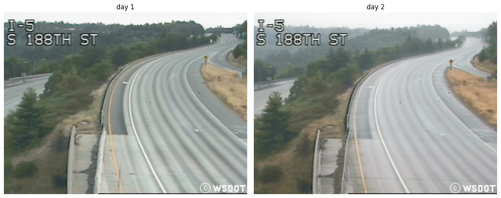
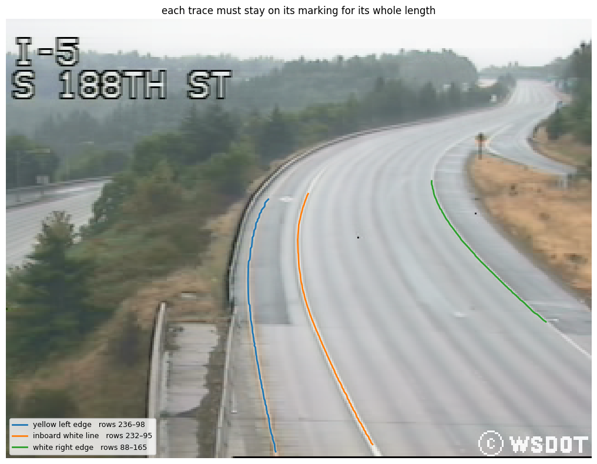
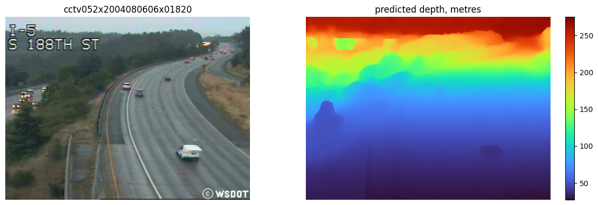
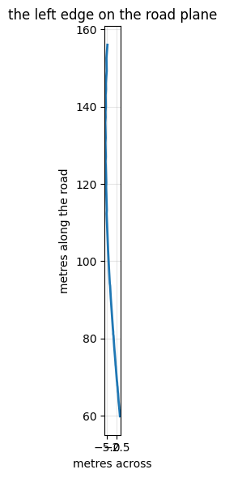
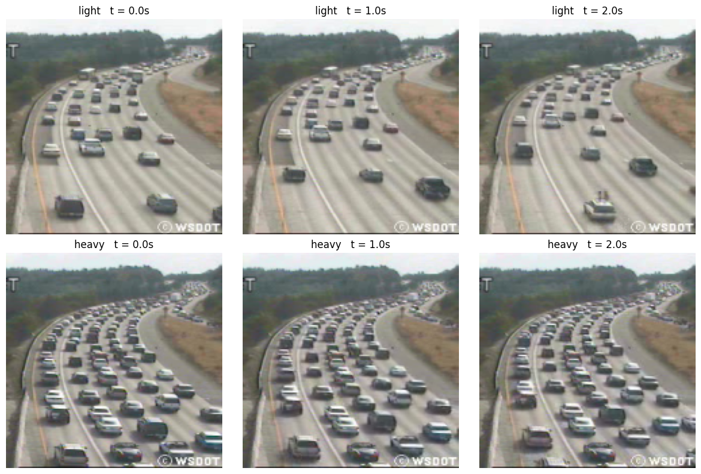
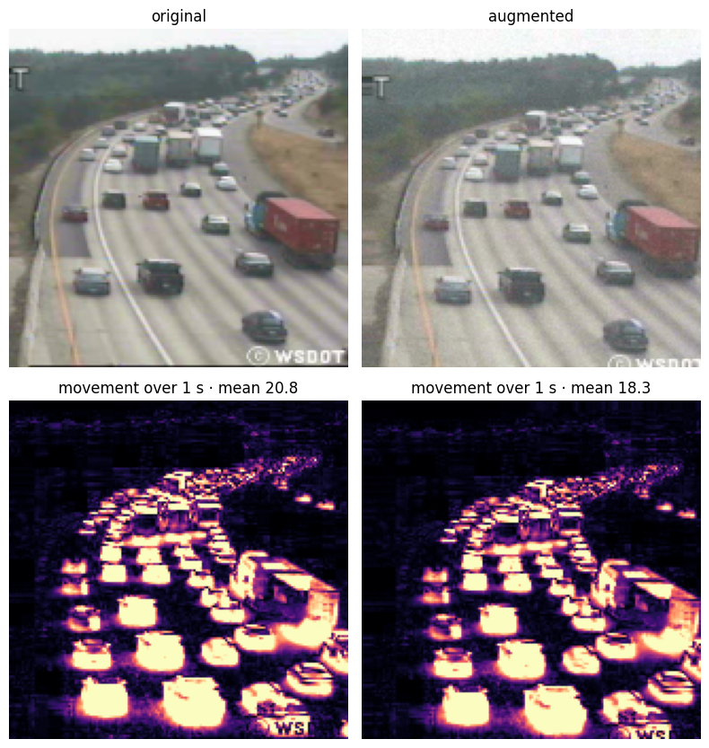

# Notebook results

Saved outputs of the Colab runs, copied by `python run.py demo`.

## 01_calibration.ipynb

### Camera calibration: pixels to metres

```
Using Colab cache for faster access to the 'highway-traffic-videos-dataset' dataset.
/content/traffic-data · 254 clips · 20040805 and 20040806
```

### 1. Build road backgrounds



```
day 1 -> day 2   dx -6.02 px   dy +5.35 px  (confidence 0.702)
```

### 2. Trace road markings



### 3. Estimate focal length



```
  cctv052x2004080516x01640  20040805  light   f =  773.6 px
  cctv052x2004080516x01638  20040805  medium  f =  782.0 px
  cctv052x2004080516x01646  20040805  heavy   f =  796.6 px
  cctv052x2004080606x01820  20040806  light   f =  800.5 px
  cctv052x2004080613x00018  20040806  medium  f =  790.4 px
  cctv052x2004080614x00026  20040806  heavy   f =  798.9 px
f = 793.5 px (median)  ->  22.8 deg field of view; frame-to-frame spread 3.4%
```

### 4. Fit the road plane and check scale

```
  y0 =    8.90      from the paint, rms 0.29 px over rows 88-165
  W  =   18.15 m    5 x 3.63 m -- external
  h  =   17.62 m    = W / 1.0299 px per row
  f  =   793.5 px   UniDepth intrinsics; its depth implies 412, spread 48.0%
HOV lane =  4.28 m    expect ~3.63 m; its horizon 20.1 against the paint 8.9
```

### 5. Map the road and account for curvature



```
camera pitch 7.53 deg   (bank is 0 by construction, not by measurement)
left edge sweeps 3.81 m = 21% of the road width; quadratic residual 1.10 px rms
visible road runs 60 m to 156 m along the road plane
```

### 6. Export calibration

```
/content/calibration.yaml 
# GENERATED by notebooks/01_calibration.ipynb -- do not edit by hand.
# What the footage cannot supply lives in config/site.yaml.
homography:
- - 0.0012602474912544563
  - 0.0
  - -0.21105547573458222
- - 0.0
  - -0.0001618723206819584
  - 1.0101300897396153
- - 0.0
  - 7.15146353348552e-05
  - -0.0006364419115237137
camera_height_m: 17.622
horizon_row: 8.899
focal_length_px: 793.5
focal_estimates:
  unidepth_intrinsics: 793.5
  unidepth_depth: 412.4
scale_spread: 0.4802
left_edge_poly:
- 0.0022174823
- -0.66968511
- 183.49876
principal_point_x: 167.471
plane_coefficients:
- 0.0
- 7.151463533e-05
- -0.0006364419115
grade_deg: 7.526
bank_deg: 0.0
day_shift_px:
  dx: -6.02
  dy: 5.35
measured_width_m: 18.15
visible_road_m:
- 59.8
- 156.0
source: notebooks/01_calibration.ipynb
notes: 'Horizon and camera height come from the painted road edges: two markings W
  metres apart separate by W/h pixels per row and meet at the horizon, so one line
  fit gives y0 = 8.90 (its zero crossing, rms 0.29 px) and h = 17.62 m (W / its slope).
  Neither reads a focal length or a depth map. measured_width_m is EXTERNAL -- 5 lanes
  x 3.63 m -- and is the only supplied number; it sets h and nothing else, so it must
  not be quoted back as a check. UniDepth v2 supplies f alone; focal_estimates records
  its intrinsics head against the f its own depth map implies through this h and y0,
  and scale_spread is how far they sit apart. f scales distance ALONG the road, and
  so speed, but not lateral position or width. The plane is level by construction
  (a = 0): bank_deg is zero by assumption and grade_deg is the CAMERA pitch, not road
  grade -- nothing here sees gravity, and one vanishing point cannot pin the tilt
  of a horizon line. The MUTCD dash cycle is NOT usable, the broken lane lines are
  not resolvable at 320x240. Visible road 60-156 m ALONG THE ROAD PLANE, the same
  coordinate RoadFrame.in_zone gates on. The road curves: the left edge sweeps 3.81
  m, so lateral position must be measured from left_edge_poly. Checks: the HOV lane
  reads 4.28 m with horizon 20.1; UniDepth f varies 3.4% over 6 frames (median used).'
```

## 02_finetune.ipynb

### Traffic congestion classifier

```
torch 2.11.0+cu128 · cuda
Tesla T4
```

### 1. Load data and define evaluation

```
Using Colab cache for faster access to the 'highway-traffic-videos-dataset' dataset.
/content/traffic-data
254 clips
```

### 1.1. Read metadata

```
clips   254 {'light': 165, 'medium': 45, 'heavy': 44}
runs    14
```

### 1.3. Baselines

```
model                            accuracy  macro-F1
majority class                      65.0%     0.263
nearest recording (no pixels)       71.3%     0.584
```

### 2. Prepare three-frame samples

```
(254, 5, 160, 160, 3)  98 MB   5 frames per clip, 1.0 s apart, 3 windows
```



### 3. Apply consistent augmentation



### 5.1. Evaluate on grouped folds

```
    epoch 60/60  loss 0.221
fine-tuned resnet18
              precision    recall  f1-score   support
       light      0.988     0.994     0.991       165
      medium      0.822     0.822     0.822        45
       heavy      0.860     0.841     0.851        44
    accuracy                          0.937       254
   macro avg      0.890     0.886     0.888       254
weighted avg      0.937     0.937     0.937       254
             pred light  pred medium  pred heavy
true light          164            1           0
true medium           2           37           6
true heavy            0            7          37 
```

### 6. Compare results

```
                              accuracy macro-F1
model                                          
majority class                   65.0%    0.263
nearest recording (no pixels)    71.3%    0.584
fine-tuned resnet18              93.7%    0.888 
Fine-tuned resnet18 on grouped folds: 93.7% accuracy, 0.888 macro-F1.
```

### 7. Train the final model and export

```
models/congestion_cnn.onnx  45 MB, carrying its own preprocessing
agrees with the trained model to 6.71e-07
models/eval_finetune.json  written
```
